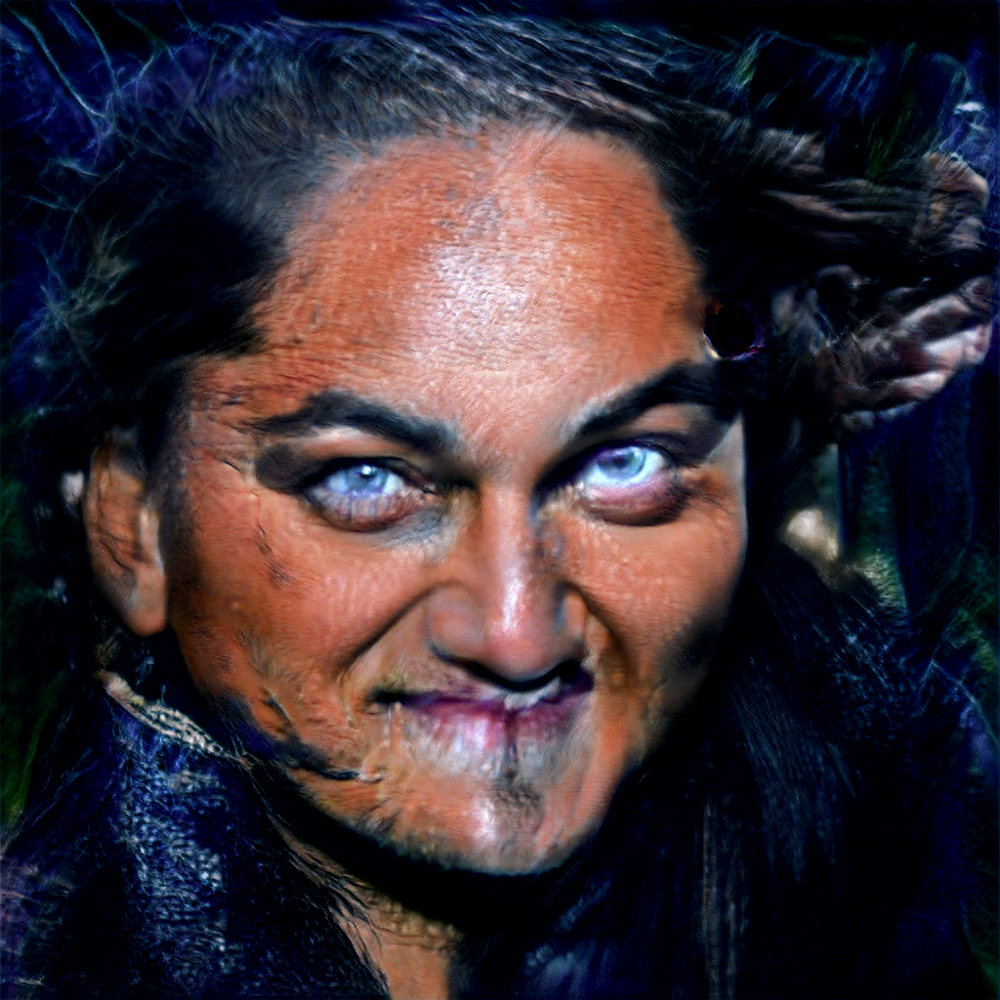

# StyleGAN  
<br> 

[This](https://github.com/NVlabs/stylegan) repository contains the official TensorFlow implementation of the following paper:  
  
> **A Style-Based Generator Architecture for Generative Adversarial Networks**<br>
> Tero Karras (NVIDIA), Samuli Laine (NVIDIA), Timo Aila (NVIDIA)<br>
> http://stylegan.xyz/paper
>
> **Abstract:** *We propose an alternative generator architecture for generative adversarial networks, borrowing from style transfer literature. The new architecture leads to an automatically learned, unsupervised separation of high-level attributes (e.g., pose and identity when trained on human faces) and stochastic variation in the generated images (e.g., freckles, hair), and it enables intuitive, scale-specific control of the synthesis. The new generator improves the state-of-the-art in terms of traditional distribution quality metrics, leads to demonstrably better interpolation properties, and also better disentangles the latent factors of variation. To quantify interpolation quality and disentanglement, we propose two new, automated methods that are applicable to any generator architecture. Finally, we introduce a new, highly varied and high-quality dataset of human faces.*  
  
<br>  

[This](https://github.com/Puzer/stylegan) repository contains the encoder for Official TensorFlow Implementation. It's used to converts real images to latent space that can be feed into StyleGAN.

<br>

### Generating latent representation 
```
python encode_images.py aligned_images/ generated_images/ latent_representations/
```
[encode_images.py](https://github.com/Puzer/stylegan/blob/master/encode_images.py) takes four useful parameters:  
>'--image_size', default=256, help='Size of images for perceptual model', type=int  
'--lr', default=1., help='Learning rate for perceptual model', type=float  
'--iterations', default=1000, help='Number of optimization steps for each batch', type=int  
'--randomize_noise', default=False, help='Add noise to dlatents during optimization', type=bool  

<br> 

#### Hyperparameter tuning
parameter - loss  
--default - 0.25  
--randomize_noise True - 0.64  
--lr 0.5 - 0.24  
--lr 1.5 - 0.22  
--image_size 1024 - 0.23  
--iterations 3000 - 0.16  
--iterations 6000 - 0.14  

Increasing iterations is the only way to decrease loss.  


Examples of how loss decreases when iterations increase  


<br> 

### Leonardo DiCaprio minus Kaur
```
type(kaur), kaur.shape
>>> (numpy.ndarray, (18, 512))
display(leo), display(kaur), display(leo - kaur)
```


  
Leonardo's eyebrows are thick and angled but mine are straight and thin.  
If you take my straight/thin and add the third pictures dark/curvy eyebrows together then you get Leonardo's eyebrows.   
So basically, it's possible to conclude whos on the first picture if you see only the second and third pictures.

<br> 

### Kaur to Leo


<br> 

### Style mixing
The original image from the paper  

<a href="https://drive.google.com/file/d/1h22wuxaoRA66zG1HYlUPfw64k5jm8H2p/view?usp=sharing"></a>  

The input (top row and left column) faces were generated like that
```
src_seeds=[639,701,687,615,2268], dst_seeds=[888,829,1898,1733,1614,845]
src_latents = np.stack(np.random.RandomState(seed).randn(512) for seed in src_seeds)
dst_latents = np.stack(np.random.RandomState(seed).randn(512) for seed in dst_seeds)
```

When random seeds are used  
```
src_seeds=[1,2,3,4,5], dst_seeds=[6,7,8,9,10,11]
```

Then the result is not so good  
<a href="https://drive.google.com/file/d/1l3oyD7ecgAWCoDtgidqpupyKFRcNd_nY/view?usp=sharing"></a>  

#### My style mixing

8 input images were trained with 1000 iterations and with 4000 iterations  
<a href="https://drive.google.com/file/d/17H_Faxs_yvidOIhofHeCvFTMC6zBTVr-/view?usp=sharing"></a>  <a href="https://drive.google.com/file/d/1JnRg-R2IltIjujDvuXgJsr7DCVd_-E_Q/view?usp=sharing"></a>

<br> 

### Style transformation
In general, it's possible to find directions of almost any face attributes: position, hairstyle or color etc.

#### Age


#### Gender


#### Smile


